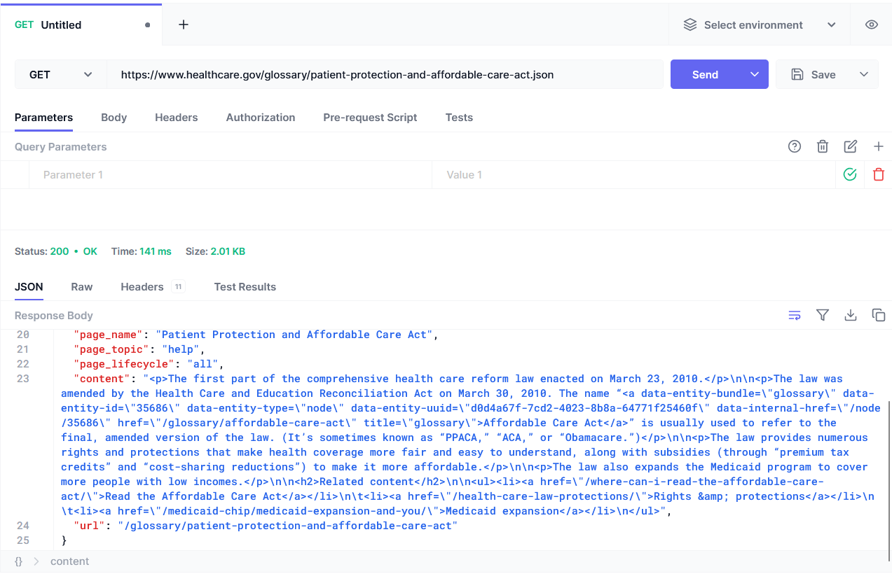

# Project for CSC207 course - Fall 2023

## Team members 
Daniel Shi, Nivadhini, Parsh, Adel Muursepp

## Problem domain & high-level description
We are focusing on creating an application in **health care** problem domain.
We are thinking of making the user experience of analyzing symptoms
and diagnosis more user-friendly and interactive. 
Some of the options for that could be gathering information
about the user regarding their age, gender, 
health risks such as smoking habits, and symptoms. 
Potentially, some computer vision could be implemented for diagnosis
if a relevant API is found.

## Some potential APIs
- [Google Cloud Vision API](https://cloud.google.com/vision) that has pre-trained AI models for analyzing images
- [Healthgraphic API](https://www.healthgraphic.com/) is a health content search and discovery API 
that allows developers to retrieve data about diseases, symptoms and medications.
- [HealthCare.gov API](https://www.healthcare.gov/developers/?ref=apilist.fun) educational health information API
which could be included to address healthcare concerns for users in the U.S.

## Possible Technical Issues
Need to figure out how to actually import tools like okhttp3.

## Example Java Code
There are two examples of Java API example calls in the repository.

## Hoppscotch Test
This is the result of putting the url from the Java code example in Hoppscotch

